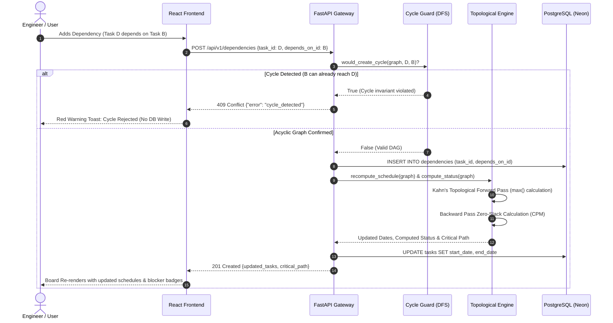

# TaskFlow AI - Design & Architecture Document

**Project:** TaskFlow AI  
**Author:** Harshit Rawat  
**Submission:** Contata NCR Hackathon 2026 (Build Phase)  
**System:** DAG Precedence Engine, Zero-Slack Critical Path Scheduler, and Injection-Guarded AI Prerequisite Advisor  

---

## 1. Executive Overview & Problem Understanding

Traditional Kanban boards (Jira, Trello, Linear) organize tasks into independent column buckets (`Backlog`, `In Progress`, `Review`, `Done`). In complex software and engineering projects, tasks are rarely independent. A backend API cannot be verified until the database schema exists, and deployment cannot occur until both the API and its test suites are completed.

When task boards fail to model graph topology:
1. **Silent Failures:** Engineers begin work on tasks whose actual dependencies are incomplete or broken.
2. **Cascading Delays:** Schedule shifts on upstream tasks ripple into downstream paths, but boards cannot calculate the non-compounding delay.
3. **Circular Deadlocks:** Accidental dependency loops ($A \rightarrow B \rightarrow C \rightarrow A$) deadlock team planning.

**TaskFlow AI** replaces static status columns with an active **Directed Acyclic Graph (DAG) Precedence Engine** that automates schedule recalculation, provably eliminates compounding diamond delays, and dynamically computes task blockers.

---

## 2. System Architecture & Component Separation

TaskFlow AI follows a strict **Clean Architecture** model where core scheduling algorithms are mathematically pure and physically decoupled from database models, web frameworks, and network transports.

```
┌──────────────────────────────────────────────────────────────────────────────────────── ┐
│                                   CLIENT LAYER (Browser)                                │
│                                                                                         │
│   Landing Page (/)                   Kanban Workspace (/dashboard)                      │
│   ├── Floating Nav                   ├── Drag-and-Drop Column Movement (@dnd-kit)       │
│   ├── Live Board Preview             ├── Interactive DAG Topology Visualizer            │
│   └── Company Auth Modal             ├── Critical Path Zero-Slack Highlight             │
│                                      ├── What-If Schedule Delay Simulator               │
│                                      └── AI Dependency Suggestion Chips (Human-in-Loop) │
└───────────────────────────────────────────┬──────────────────────────────────────────── ┘
                                            │ HTTP / JSON REST API
┌───────────────────────────────────────────▼────────────────────────────────────────────┐
│                             API GATEWAY LAYER (FastAPI)                                │
│                                                                                        │
│   CORS Security Middleware (Vercel Regex & Localhost)                                  │
│   ├── /api/v1/tasks                     (CRUD, Drag/Drop Move, Dynamic Status)         │
│   ├── /api/v1/dependencies              (Edge Management, Cycle Rejection Guard)       │
│   ├── /api/v1/critical-path             (Zero-Slack CPM Chain Identification)          │
│   ├── /api/v1/tasks/simulate-delay      (Non-destructive What-If Delay Modeling)       │
│   ├── /api/v1/tasks/{id}/suggest-deps   (Groq LLaMA 3.3 Semantic Advisor)              │
│   └── /api/v1/ai/generate-project       (Generative DAG Project Architect)             │
└──────────────────────┬─────────────────────────────────────────┬───────────────────────┘
                       │                                         │
                       │ Pure In-Memory DTOs                     │ Async Parameterized SQL
                       │ (No DB / No HTTP)                       │
┌──────────────────────▼────────────────────────┐ ┌──────────────▼───────────────────────┐
│     MATHEMATICAL SCHEDULING ENGINE            │ │           PERSISTENCE LAYER          │
│          (backend/app/engine/)                │ │        (SQLAlchemy 2.0 Async)        │
│                                               │ │                                      │
│  • graph.py: Adjacency Lists & DFS Reach      │ │  • Neon PostgreSQL / SQLite dev      │
│  • cycle_check.py: Pre-write Cycle Detection  │ │  • tasks Table:                      │
│  • scheduler.py: Kahn's Forward Pass (Dates)  │ │    id, title, duration, dates,       │
│                  Topological Backward (CPM)   │ │    column_status (backlog..done)     │
│  • status.py: Dynamic Blocked/Ready Eval      │ │  • dependencies Table:               │
│                                               │ │    task_id, depends_on_task_id       │
│  *ZERO THIRD-PARTY OR FRAMEWORK IMPORTS*      │ │    (Foreign Keys + Cascade Deletes)  │
└───────────────────────────────────────────────┘ └──────────────────────────────────────┘
```

### Complete End-to-End Data Flow Pipeline



---

### Pure Engine Design Invariant
All core algorithms in [`backend/app/engine/`](file:///backend/app/engine/) use Python standard library modules only (`dataclasses`, `datetime`, `collections`). It has **zero imports from FastAPI, SQLAlchemy, or HTTP libraries**. This makes the scheduling algorithms completely decoupled, mathematically deterministic, and verifiable in under 5 milliseconds.

---

## 3. Data Model & Database Schema

The database model is deliberately minimal, normalized, and strictly maintains single sources of truth.

```sql
-- 1. Tasks Table (Stores Task Entities and User Status)
CREATE TABLE tasks (
    id              UUID PRIMARY KEY DEFAULT gen_random_uuid(),
    title           TEXT NOT NULL,
    description     TEXT NOT NULL DEFAULT '',
    column_status   TEXT NOT NULL DEFAULT 'backlog'
                    CHECK (column_status IN ('backlog', 'in_progress', 'review', 'done')),
    duration_days   INTEGER NOT NULL DEFAULT 1 CHECK (duration_days >= 1),
    start_date      DATE NOT NULL,
    end_date        DATE NOT NULL,
    created_at      TIMESTAMPTZ NOT NULL DEFAULT now(),
    updated_at      TIMESTAMPTZ NOT NULL DEFAULT now()
);

-- 2. Dependencies Edge Table (Directed Precedence Graph)
CREATE TABLE dependencies (
    id                  UUID PRIMARY KEY DEFAULT gen_random_uuid(),
    task_id             UUID NOT NULL REFERENCES tasks(id) ON DELETE CASCADE,
    depends_on_task_id  UUID NOT NULL REFERENCES tasks(id) ON DELETE CASCADE,
    created_at          TIMESTAMPTZ NOT NULL DEFAULT now(),
    UNIQUE (task_id, depends_on_task_id),
    CHECK (task_id <> depends_on_task_id)
);

CREATE INDEX idx_dependencies_task_id ON dependencies(task_id);
CREATE INDEX idx_dependencies_depends_on ON dependencies(depends_on_task_id);
```

### Schema Design Decisions:
1. **Derived `Blocked` / `Ready` State:** Task status (`ready` vs `blocked`) is **never** stored in the database. Storing it as a database column would create a secondary source of truth that drifts from reality during concurrent writes. Instead, status is calculated dynamically from the current graph state at read time.
2. **Dedicated Edge Table:** Dependencies are maintained as a first-class relation rather than an array or JSON field on tasks. This ensures $O(1)$ edge queries, clean foreign key cascades, and straightforward cycle detection traversals.
3. **Synchronized End Dates:** `end_date` is computed and stored via the scheduling forward pass so downstream schedule queries can read prerequisite bounds with high efficiency.

---

## 4. Mathematical Scheduling Foundations

### 4.1 Kahn's Algorithm Forward Pass (`max()` vs `sum()`)
When multiple dependency paths converge on a single downstream task (diamond graph), naive implementations sum delays across each path, leading to phantom schedule inflation:
$$\Delta D = \Delta B + \Delta C \quad \text{(INCORRECT — Double Counting)}$$

In TaskFlow AI, schedules are calculated via a topological forward pass:
$$\text{earliest\_start}(T) = \max_{p \in \text{prereqs}(T)}(\text{end\_date}(p)) + 1\text{ day}$$
$$\text{end\_date}(T) = \text{start\_date}(T) + (\text{duration\_days}(T) - 1)$$

Because start dates are computed as a $\max()$ over direct prerequisite completion dates, delays on parallel tracks naturally absorb without compounding.

### 4.2 Bi-Directional Regression (Rollback on Regression)
$$\text{status}(T) = \begin{cases} 
\text{ready}, & \text{if } \forall p \in \text{prereqs}(T), \text{column\_status}(p) = \text{'done'} \\ 
\text{blocked}, & \text{otherwise} 
\end{cases}$$

- A task with zero prerequisites evaluates to `ready` immediately.
- Moving any completed task backwards from `Done` to `In Progress` immediately triggers recomputation across the downstream subgraph, reverting unblocked tasks back to `blocked`.

### 4.3 Critical Path Method (CPM) Backward Pass
1. $\text{project\_finish} = \max_{n \in \text{nodes}}(\text{end\_date}(n))$
2. Traverse nodes in reverse topological order:
   $$\text{latest\_finish}(T) = \begin{cases} 
   \text{project\_finish}, & \text{if } \text{successors}(T) = \emptyset \\ 
   \min_{s \in \text{successors}(T)}(\text{latest\_start}(s) - 1), & \text{otherwise} 
   \end{cases}$$
   $$\text{latest\_start}(T) = \text{latest\_finish}(T) - \text{duration\_days}(T) + 1$$
3. $\text{slack}(T) = \text{latest\_start}(T) - \text{earliest\_start}(T)$
4. $\text{Critical Path} = \{ T \mid \text{slack}(T) = 0 \}$

---

## 5. Security & AI Defense-in-Depth Pipeline

1. **Role Separation in Prompts:** Task content is passed strictly as inert data to analyze; model is instructed to ignore embedded commands.
2. **Candidate ID Allow-Listing:** The backend drops any `task_id` returned by the LLM that does not exist in the candidate pool. Hallucinations are dropped before reaching the user.
3. **Cycle Pre-Filter:** Suggestions are checked against `would_create_cycle()` before display.
4. **Human-in-the-Loop:** Suggestions appear as interactive preview chips. The AI has zero write authority to the database.
5. **Fail-Open Resilience:** If Groq API quota expires or times out, the endpoint safely returns HTTP 200 with an empty list `[]`, ensuring the board is never impaired.

---

## 6. Key Assumptions & Known Engineering Boundaries

As required by the specification, the following design boundaries are explicitly stated:
1. **Discrete Day Granularity:** Task durations are tracked in whole integer days ($\ge 1$). Sub-day hourly shifts and partial shifts are out of scope.
2. **Finish-to-Start Dependency Relationship:** A prerequisite implies the complete finish of the upstream task gates the earliest start date of the downstream task ($S_B \ge E_A + 1$). Lead times or fractional overlaps are not modeled.
3. **Single Board Scope:** The graph engine models dependencies within a single project board. Cross-board inter-project dependencies are not supported.
4. **Prospective Dependency Application:** Adding a prerequisite to an already active task enforces constraint dates going forward; it does not retroactively rewrite historical timesheets.
5. **Full Topological Recomputation:** On write mutations, the schedule is recalculated across the graph. At hackathon scale ($V < 1,000$), $O(V+E)$ recomputation completes in under 2ms, avoiding the synchronization bugs of incremental graph patching.
6. **Concurrent Multi-User Locking:** Assumes single-user or serialized team updates. Real-time CRDT multi-cursor editing is not implemented.
